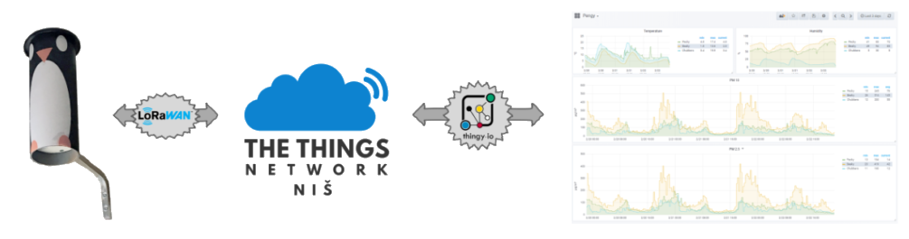

# Air Quality Monitoring

**Pengy** is the system for monitoring of the air quality parameters.

The system concept and how it is build are described in the personal blog [quo.vadis.stojkovic.ch](https://quo.vadis.stojkovic.ch/air-pollution-monitor/)

## Description

The sensors on the nodes (*SDS012* and *DHT22*) are measuring the relevant air parameters (t, RH, PM10 and PM2.2), data is acquiried with *LoRa32u4II* device and sent using *LoRaWAN* via *The Things Network* platform. Integration to *Thingy* as well to *Luftdaten* platofrm is used later for the visualization of the results.

## Content

* In the folder [firmware](firmware/), you can find the latest firmaware for a Pengy node
* Integration with *The Things Network* is in folder [ttn](integration/ttn/)
* Python script to push the data to *Luftdaten* platform is in folder [luftdaten](integration/luftdaten/)
* Python script to push the data to *Pulse.Eco* platform is in folder [pulse.eco](integration/pulse.eco/)
* Supporting pictures, drawings and diagrams you can find under [media](media/) folder
* Some additional documentation can be found under [docs](firmware/docs/)

## Additional information

More information regarding LoRaWAN and The Things Network can be found on their sites [LoRa Alliance](https://lora-alliance.org/about-lorawan) and [The Things Network](https://www.thethingsnetwork.org/).

More information about Citizen Science project **Luftdaten** can be found here: [https://luftdaten.info/](https://luftdaten.info/)

More information about crowdsourcing platform **Pulse.Eco** can be found here: [https://pulse.eco/](https://pulse.eco/)

## Notice
Due to the DIY nature of this system, the resulting measurements cannot be considered as more precise or accurate than the official measurement performed.

## License

Copyright (c) 2019 Dušan Stojković