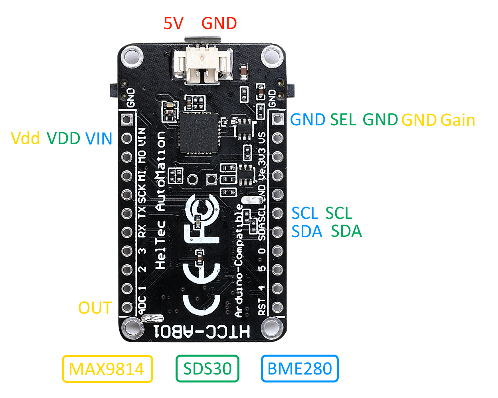
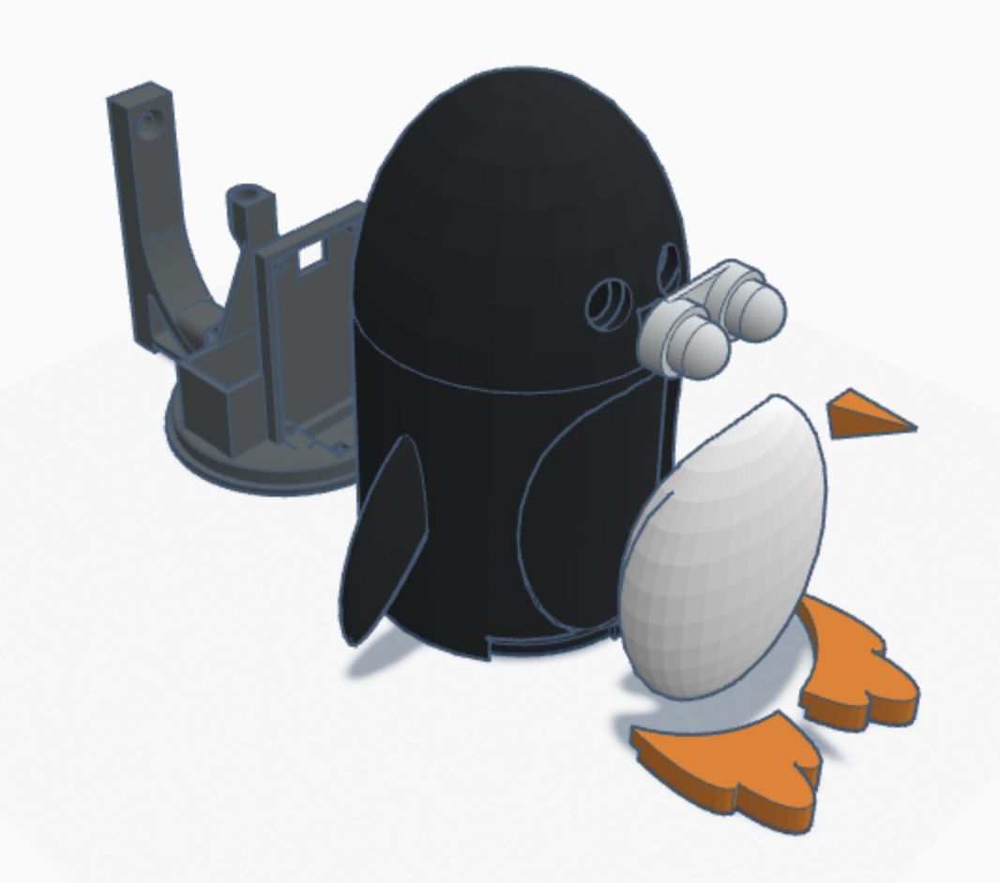

# Air Quality Monitoring

**Pengy** is the system for monitoring of the air quality parameters.

The system concept and how it is build are described in the personal blog [quo.vadis.stojkovic.ch](https://quo.vadis.stojkovic.ch/air-pollution-monitor/)

## Description

The sensors on the nodes are measuring the relevant air parameters (t, RH, p, PM1.0, PM2.5, PM10 ...), data is acquired with [*Heltec CubeCell (HTCC-AB01)*](https://heltec.org/project/htcc-ab01/) device and sent using *LoRaWAN* via *The Things Network* platform. Integration to *Thingy*, as well to *Sensor Community* and *Pulse.Eco* platforms, is used for the visualization of the results.

Depending on the version, different sensors are used and different parameters are measured.
In the current version (2.0), parameters that are measured are: 
- air temperature (t)
- air relative humidity (RH)
- atmospheric pressure (p)
- environmental noise
- respirable (<10μm) particulate matter mass concentration (PM 10)
- fine (<2.5 μm) particulate matter mass concentration (PM 2.5)
- ultra fine (<1 μm) particulate matter mass concentration (PM 1)

using the following sensors:
- SPS30
- BME280
- MAX9814 amplifier based microphone

For the overview of the parameters and sensor used in previous version, refer to:
- version 1.5 - https://github.com/dusanstojkovic/pengy/tree/v1.5
- version 1.0 - https://github.com/dusanstojkovic/pengy/tree/v1.0

## Content

* In the folder [firmware](firmware/), you can find the latest firmware for a Pengy node
* Integration with *The Things Network* is in folder [ttn](integration/ttn/)
* Python script to push the data to *Sensor Community* platform is in folder [sensor.community](integration/sensor.community/)
* Python script to push the data to *Pulse.Eco* platform is in folder [pulse.eco](integration/pulse.eco/)
* STL files for 3D printing of the enclosure are located in folder [enclosure](enclosure/)
* Supporting pictures, drawings and diagrams you can find under [media](media/) folder
* Some additional documentation can be found under [misc](misc/) and [docs](firmware/docs/)

## Electrical schema, enclosure and assembly

There are only couples of the components that need to be soldered. Only basic soldering skills are required. Here is a simplified electrical schema:

Keep in mind that 2 pull up resistors on I2C lines should be used for **SDS30**.

In this version of Pengy, there is the 3D printed enclosure available, which simplifies assembling of the whole sensor:

All files needed for 3D printing are located in folder  [enclosure](enclosure/). The whole design is also available on [Tinkercad](https://www.tinkercad.com/embed/jLOi4Yv6dmK) in case any modifications or adaptations needed.

The final assembly should be straightforward. There is a 'embedded' place for each electronic component modeled into the enclosure mount part. The rest of the enclosure parts can be glued together.

## EAQI - European Air Quality Index

One of the parameters that is calculated based on particulate matter concentrations measured is _European Air Quality Index_ - EAQI. More information about the index and methodology can be found http://airindex.eea.europa.eu/.

As a special feature, Pengy device would light up its eyes in the color that corresponds to the current air quality:

## Additional information

More information regarding LoRaWAN and The Things Network can be found on their sites [LoRa Alliance](https://lora-alliance.org/about-lorawan) and [The Things Network](https://www.thethingsnetwork.org/).

More information about the contribution driven global sensor network  **Sensor Community** can be found here: [https://sensor.community/](https://sensor.community/)

More information about the environmental data crowdsourcing platform **Pulse.Eco** can be found here: [https://pulse.eco/](https://pulse.eco/)

## Notice
Due to the DIY nature of this system, the resulting measurements cannot be considered as more precise or accurate than the official measurement performed.