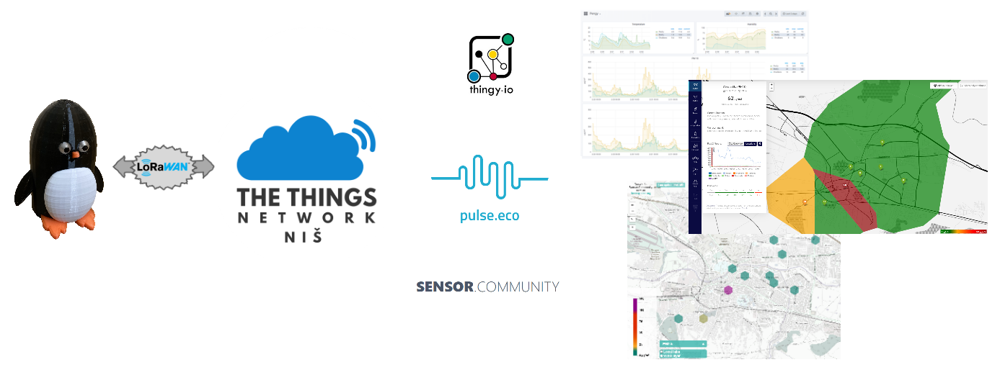

# Air Quality Monitoring

**Pengy** is the system for monitoring of the air quality parameters.

The system concept and how it is build are described in the personal blog [quo.vadis.stojkovic.ch](https://quo.vadis.stojkovic.ch/air-pollution-monitor/)

## Description

The sensors on the nodes are measuring the relevant air parameters (t, RH, p, PM10, PM2.2, ...), data is acquiried with *LoRa32u4II* device and sent using *LoRaWAN* via *The Things Network* platform. Integration to *Thingy* as well to *Sensor Community* and *Pulse.Eco* platoforms is used for the visualization of the results.

Depending on the version, different sensors are used, different parameters are measured.
In the current version (1.5), parameters that are measured are: 
- air temperature (t)
- air relative humidity (RH)
- atmospheric pressure (p)
- environmental noise
- respirable (<10μm) particulate matter mass concetration (PM 10)
- fine (<2.5 μm) particulate matter mass concetration (PM 2.5)
- carbon monoxide concetration (CO)
- nitrogen dioxide concetration(NO2)
- ammonia concetration (NH3)

using the following sensors:
- SDS011 
- BME680
- MiCS-6814
- LM386

In the previous versions (1.x), the following parameters are measured:
- air temperature (t)
- air relative humidity (RH)
- respirable (<10μm) particulate matter mass concetration (PM 10)
- fine (<2.5 μm) particulate matter mass concetration (PM 2.5)

using the following sensors:
- SDS012
- DHT22

## Content

* In the folder [firmware](firmware/), you can find the latest firmaware for a Pengy node
* Integration with *The Things Network* is in folder [ttn](integration/ttn/)
* Python script to push the data to *Sensor Community* platform is in folder [sensor.community](integration/sensor.community/)
* Python script to push the data to *Pulse.Eco* platform is in folder [pulse.eco](integration/pulse.eco/)
* Supporting pictures, drawings and diagrams you can find under [media](media/) folder
* Some additional documentation can be found under [docs](firmware/docs/)

## Additional information

More information regarding LoRaWAN and The Things Network can be found on their sites [LoRa Alliance](https://lora-alliance.org/about-lorawan) and [The Things Network](https://www.thethingsnetwork.org/).

More information about the contribution driven global sensor network  **Sensor Community** can be found here: [https://sensor.community/](https://sensor.community/)

More information about the environmental data crowdsourcing platform **Pulse.Eco** can be found here: [https://pulse.eco/](https://pulse.eco/)

## Notice
Due to the DIY nature of this system, the resulting measurements cannot be considered as more precise or accurate than the official measurement performed.

## License

Copyright (c) 2021 Dušan Stojković